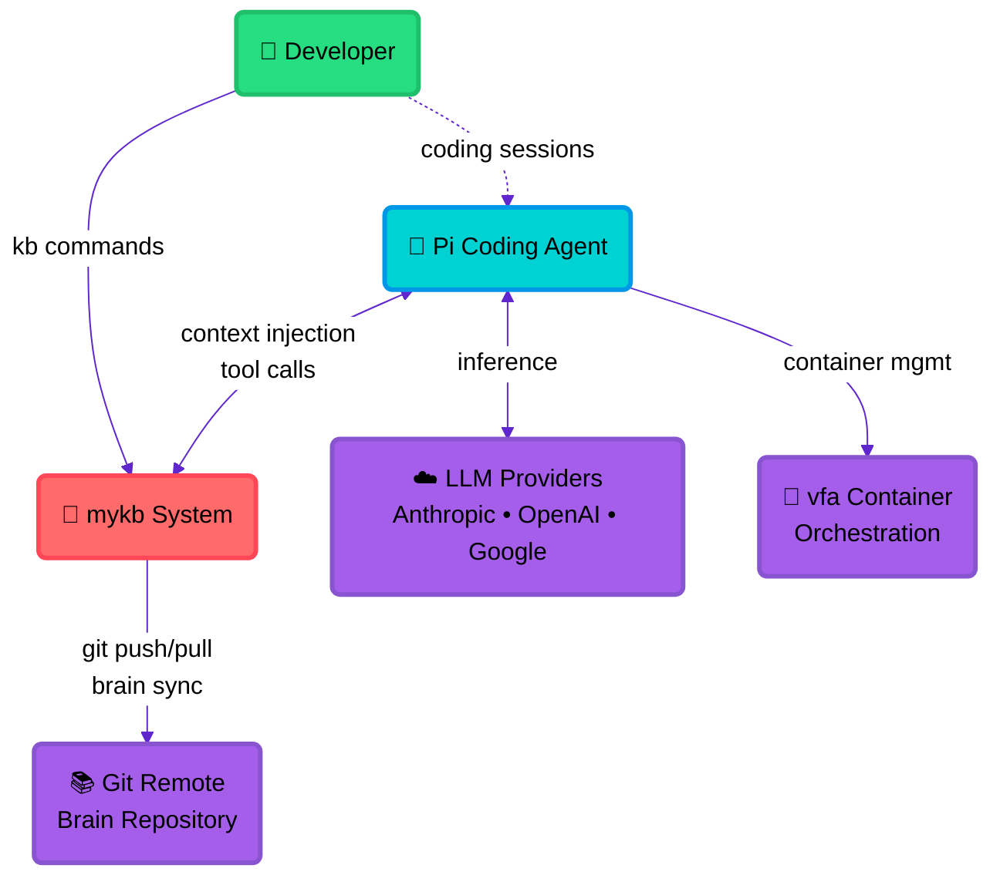
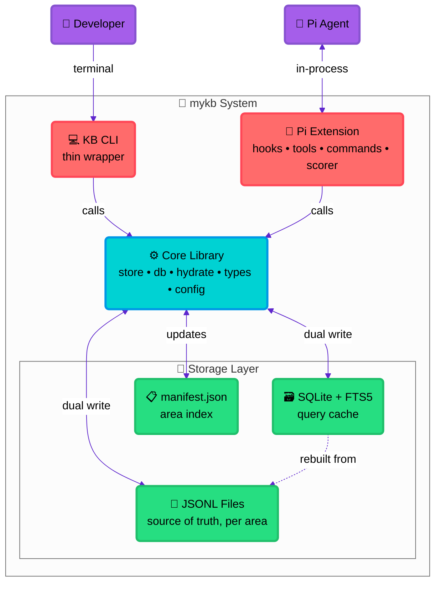
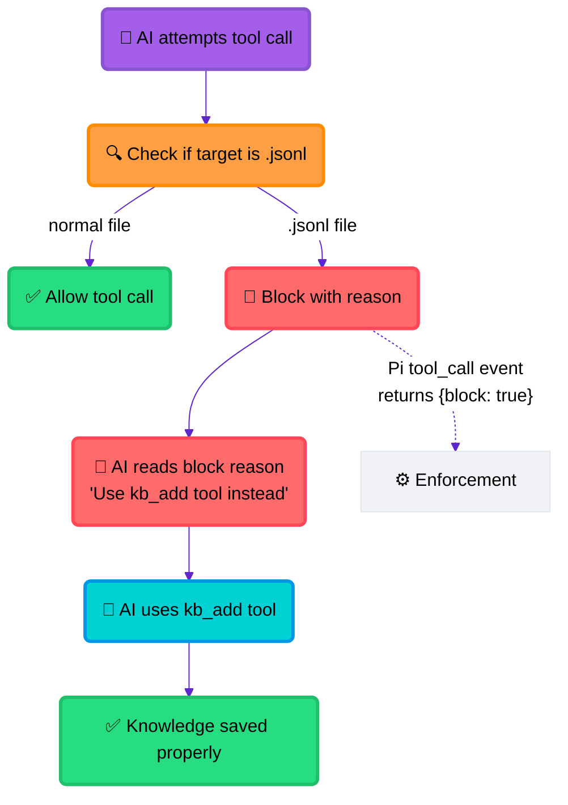
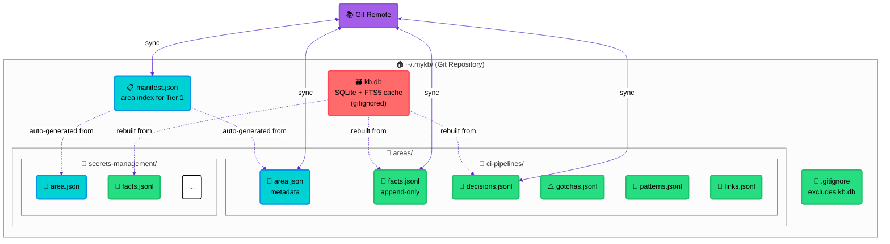
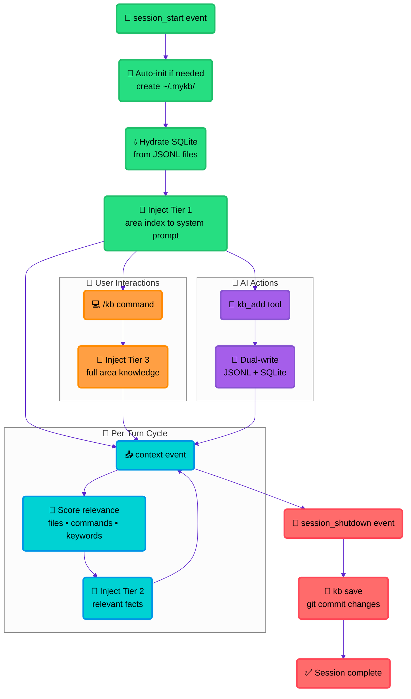

# mykb Architecture Diagrams

## 1. C4 Context Diagram

This diagram shows mykb within its broader ecosystem, including the key external actors and systems it interacts with. Note how mykb acts as a bridge between the developer, the AI agent, and persistent knowledge storage.

## 2. C4 Container Diagram

This diagram reveals the internal structure of mykb, showing how the Pi Extension and KB CLI both rely on a shared Core Library. The dual-write strategy ensures immediate consistency between JSONL source files and the SQLite query cache.

## 3. Data Flow: Write Path

This diagram shows the atomic dual-write strategy that ensures immediate consistency. Every write operation updates both the JSONL source of truth and the SQLite cache in a single transaction, making data immediately queryable.

```mermaid
%%{init: {
  "theme": "neutral",
  "themeVariables": {
    "primaryColor": "#ff6b6b",
    "primaryTextColor": "#000",
    "primaryBorderColor": "#ff4757",
    "lineColor": "#5f27cd",
    "secondaryColor": "#00d2d3",
    "tertiaryColor": "#ff9ff3",
    "background": "#ffffff",
    "mainBkg": "#ffffff",
    "secondBkg": "#f1f2f6",
    "tertiaryBkg": "#dfe6e9"
  },
  "flowchart": {
    "nodeSpacing": 50,
    "rankSpacing": 50,
    "curve": "basis"
  }
}}%%

flowchart LR
    START("🚀 kb_add tool called")
    VALIDATE("✅ Validate input")
    GENERATE("🎲 Generate nanoid")
    APPEND("📝 Append to JSONL")
    UPSERT("💾 UPSERT SQLite")
    FTS("🔍 Update FTS5 index")
    CONFIRM("✅ Return ID + counts")

    START --> VALIDATE
    VALIDATE --> GENERATE
    GENERATE --> APPEND
    APPEND --> UPSERT
    UPSERT --> FTS
    FTS --> CONFIRM

    %% Error path
    VALIDATE -.->|"validation fails"| ERROR("❌ Return error")

    %% Annotations
    APPEND -.->|"git-tracked"| GITLABEL["🔄 Source of truth"]
    UPSERT -.->|"gitignored"| CACHELABEL["⚡ Query cache"]

    %% Styling
    classDef default fill:#ffffff,stroke:#000,stroke-width:2px,color:#000
    classDef process fill:#00d2d3,stroke:#0097e6,stroke-width:3px,color:#000
    classDef storage fill:#26de81,stroke:#20bf6b,stroke-width:3px,color:#000
    classDef error fill:#ff6b6b,stroke:#ff4757,stroke-width:3px,color:#000
    classDef label fill:#f1f2f6,stroke:#dfe6e9,stroke-width:1px,color:#000

    class START,VALIDATE,GENERATE process
    class APPEND,UPSERT,FTS storage
    class ERROR error
    class GITLABEL,CACHELABEL label
```

## 4. Data Flow: Read Path (Three Tiers)

This diagram illustrates mykb's sophisticated three-tier context delivery system. Each tier serves a different purpose: global awareness, automatic relevance, and on-demand deep dives.

```mermaid
%%{init: {
  "theme": "neutral",
  "themeVariables": {
    "primaryColor": "#ff6b6b",
    "primaryTextColor": "#000",
    "primaryBorderColor": "#ff4757",
    "lineColor": "#5f27cd",
    "secondaryColor": "#00d2d3",
    "tertiaryColor": "#ff9ff3",
    "background": "#ffffff",
    "mainBkg": "#ffffff",
    "secondBkg": "#f1f2f6",
    "tertiaryBkg": "#dfe6e9"
  },
  "flowchart": {
    "nodeSpacing": 50,
    "rankSpacing": 50,
    "curve": "basis"
  }
}}%%

flowchart TB
    subgraph "🥇 Tier 1: Always Loaded"
        SESSION("🏁 session_start event")
        READMAN("📋 Read manifest.json")
        INJECT1("💉 Inject area index<br/>into system prompt")
        TIER1("✨ ~500 tokens<br/>area summaries only")
    end

    subgraph "🥈 Tier 2: Auto-Injected"
        CONTEXT("🔄 context event<br/>per turn")
        SCORE("🎯 Scorer collects signals<br/>files • commands • keywords")
        FTS("🔍 FTS5 query for<br/>relevant areas")
        INJECT2("💉 Inject relevant facts<br/>into message history")
        TIER2("⚡ ~2000 tokens<br/>contextual facts")
    end

    subgraph "🥉 Tier 3: On-Demand"
        COMMAND("💻 /kb command<br/>user requests area")
        LOAD("📚 Core loads full area<br/>all facts, decisions, gotchas")
        INJECT3("💉 Inject complete area<br/>into context")
        TIER3("🌊 No limit<br/>full area knowledge")
    end

    SESSION --> READMAN --> INJECT1 --> TIER1
    CONTEXT --> SCORE --> FTS --> INJECT2 --> TIER2
    COMMAND --> LOAD --> INJECT3 --> TIER3

    %% Styling
    classDef default fill:#ffffff,stroke:#000,stroke-width:2px,color:#000
    classDef tier1 fill:#ff9f43,stroke:#ff8c00,stroke-width:3px,color:#000
    classDef tier2 fill:#00d2d3,stroke:#0097e6,stroke-width:3px,color:#000
    classDef tier3 fill:#26de81,stroke:#20bf6b,stroke-width:3px,color:#000
    classDef process fill:#a55eea,stroke:#8854d0,stroke-width:3px,color:#000

    class SESSION,READMAN,INJECT1,TIER1 tier1
    class CONTEXT,SCORE,FTS,INJECT2,TIER2 tier2
    class COMMAND,LOAD,INJECT3,TIER3 tier3
```

## 5. Data Flow: Tool Gating

This diagram shows mykb's enforcement mechanism that prevents the AI from directly editing knowledge files while providing helpful guidance toward the proper tools.

## 6. Component Relationship Diagram

This diagram shows the internal src/ directory structure and how the different modules import and depend on each other. The core library is the foundation that both CLI and extension build upon.

```mermaid
%%{init: {
  "theme": "neutral",
  "themeVariables": {
    "primaryColor": "#ff6b6b",
    "primaryTextColor": "#000",
    "primaryBorderColor": "#ff4757",
    "lineColor": "#5f27cd",
    "secondaryColor": "#00d2d3",
    "tertiaryColor": "#ff9ff3",
    "background": "#ffffff",
    "mainBkg": "#ffffff",
    "secondBkg": "#f1f2f6",
    "tertiaryBkg": "#dfe6e9"
  },
  "flowchart": {
    "nodeSpacing": 50,
    "rankSpacing": 50,
    "curve": "basis"
  }
}}%%

flowchart TB
    subgraph "📦 src/core/ (Shared Library)"
        STORE("📄 store.ts<br/>JSONL read/write")
        DB("🗃️ db.ts<br/>SQLite + FTS5")
        HYDRATE("💧 hydrate.ts<br/>JSONL → SQLite")
        TYPES("🏷️ types.ts<br/>shared definitions")
        CONFIG("⚙️ config.ts<br/>brain location")
    end

    subgraph "💻 src/cli/"
        CLI("🖥️ cli.ts<br/>main entry point")
        COMMANDS("📋 commands/<br/>command handlers")
        RENDER("🎨 render.ts<br/>markdown output")
    end

    subgraph "🔧 src/extension/"
        EXT("🎛️ index.ts<br/>Pi extension entry")

        subgraph "🪝 hooks/"
            SESSION("🏁 session.ts<br/>start/shutdown")
            CONTEXT("🔄 context.ts<br/>Tier 2 injection")
            INPUT("⌨️ input.ts<br/>area matching")
            TOOLCALL("📞 tool-call.ts<br/>gating + detection")
            TOOLRESULT("📋 tool-result.ts<br/>observation")
        end

        STATE("💾 state.ts<br/>session memory")
        SCORER("🎯 scorer.ts<br/>relevance scoring")
    end

    subgraph "🛠️ src/tools/"
        TOOLS("🔨 kb_add • kb_search<br/>kb_load • kb_list • kb_verify")
    end

    %% Import relationships
    CLI --> STORE
    CLI --> DB
    CLI --> TYPES
    CLI --> CONFIG
    COMMANDS --> STORE
    COMMANDS --> DB
    RENDER --> TYPES

    EXT --> STORE
    EXT --> DB
    EXT --> TYPES
    EXT --> CONFIG
    SESSION --> HYDRATE
    CONTEXT --> SCORER
    CONTEXT --> DB
    SCORER --> DB
    SCORER --> TYPES
    TOOLS --> STORE
    TOOLS --> DB

    %% Styling
    classDef default fill:#ffffff,stroke:#000,stroke-width:2px,color:#000
    classDef core fill:#ff6b6b,stroke:#ff4757,stroke-width:3px,color:#000
    classDef cli fill:#00d2d3,stroke:#0097e6,stroke-width:3px,color:#000
    classDef extension fill:#26de81,stroke:#20bf6b,stroke-width:3px,color:#000
    classDef tools fill:#a55eea,stroke:#8854d0,stroke-width:3px,color:#000

    class STORE,DB,HYDRATE,TYPES,CONFIG core
    class CLI,COMMANDS,RENDER cli
    class EXT,SESSION,CONTEXT,INPUT,TOOLCALL,TOOLRESULT,STATE,SCORER extension
    class TOOLS tools
```

## 7. Storage Layout Diagram

This diagram shows the ~/.mykb/ directory structure and how the git-tracked source files relate to the gitignored query cache. The manifest provides fast area lookups while individual JSONL files contain the detailed knowledge.

## 8. Session Lifecycle

This diagram shows the complete lifecycle of a Pi session with mykb, from initialization through active work to graceful shutdown with automatic knowledge persistence.

## Design Choices

### Color Scheme
- **Coral Red (#ff6b6b)** - Core systems and critical paths
- **Cyan (#00d2d3)** - Processing and active components
- **Green (#26de81)** - Storage and data persistence
- **Purple (#a55eea)** - External systems and AI components
- **Orange (#ff9f43)** - User interactions and interfaces

### Emoji Selection
Each component type has a consistent emoji for instant recognition:
- 🧠 mykb system (the brain)
- 🤖 AI agents and automated processes
- 👤 Human users and developers
- 📄 JSONL files and source data
- 🗃️ SQLite databases and caches
- 🔧 Extensions and tools
- 💻 CLI interfaces
- 🔄 Processes and workflows

### Layout Philosophy
- **Top-down flows** for hierarchical relationships
- **Left-right flows** for sequential processes
- **Subgraphs** to group related components
- **Dotted lines** for derived relationships
- **Solid lines** for direct interactions

## Customization Options

To adapt these diagrams:
- **Change colors**: Modify the themeVariables section
- **Add components**: Follow the emoji and color conventions
- **Modify layout**: Adjust nodeSpacing and rankSpacing values
- **Update relationships**: Add new arrows with descriptive labels