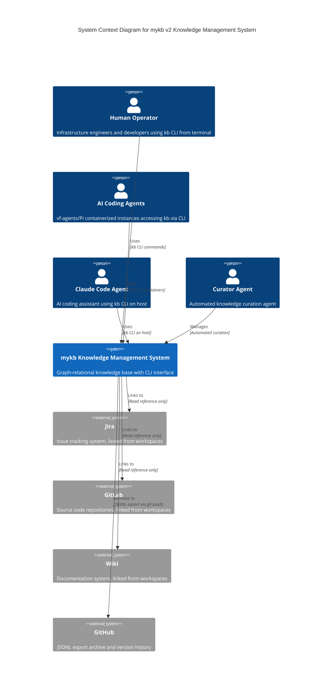
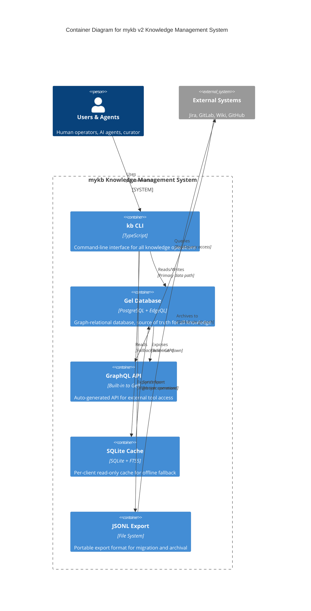

# mykb v2 Graph Backend - C4 Architecture Diagrams

This document contains the complete C4 architecture for the mykb v2 knowledge management system, showing the system context, container architecture, and detailed component design of the kb CLI.

## C1 - System Context Diagram

The system context diagram shows how the mykb knowledge management system fits into the broader ecosystem, including all the different types of users and external systems it integrates with.



## C2 - Container Diagram

The container diagram shows the major containers within the mykb system and how they interact. The system is built around Gel (PostgreSQL) as the primary store with local SQLite caches for offline fallback.



## C3 - Component Diagram (kb CLI)

The component diagram shows the internal structure of the kb CLI, including the store abstractions, relationship extraction, and audit logging that power the graph-relational knowledge management.

```mermaid
C4Component
    title Component Diagram for kb CLI Container

    Person(user, "User/Agent", "Operators using kb commands")
    Container_Ext(gel_db, "Gel Database", "PostgreSQL + EdgeQL", "Primary graph-relational store")
    Container_Ext(sqlite_cache, "SQLite Cache", "SQLite + FTS5", "Local read-only cache")

    System_Boundary(cli, "kb CLI Container") {
        Component(commands, "CLI Commands", "Commander.js", "kb add, load, search, traverse, relate, export, sync")
        Component(client, "KbClient", "TypeScript", "Router/orchestrator, checks Gel availability, routes operations")
        Component(audited, "AuditedStore", "Decorator Pattern", "Wraps GelStore, creates ChangeLog entries, audit attribution")
        Component(gel_store, "GelStore", "TypeScript", "Primary store implementation, handles CRUD and graph operations")
        Component(sqlite_store, "SqliteCacheStore", "TypeScript", "Offline cache, implements KnowledgeReader only")
        Component(extractor, "RelationshipExtractor", "TypeScript", "Analyzes text, extracts implicit relationships with confidence scores")

        Component_Boundary(interfaces, "Store Interfaces") {
            Component(reader, "KnowledgeReader", "Interface", "loadArea, search, matchAreas")
            Component(writer, "KnowledgeWriter", "Interface", "addFact, addDecision, updateEntry, deleteEntry")
            Component(grapher, "GraphQuerier", "Interface", "traverse, related, impact, relate, unrelate")
        }
    }

    Rel(user, commands, "Uses", "kb CLI commands")
    Rel(commands, client, "Calls", "Routed operations")

    Rel(client, audited, "Writes via", "All write/graph operations")
    Rel(client, sqlite_store, "Reads via", "Fallback when Gel down")

    Rel(audited, gel_store, "Wraps", "Adds audit logging")
    Rel(gel_store, gel_db, "Connects to", "EdgeQL client")
    Rel(sqlite_store, sqlite_cache, "Connects to", "SQL queries")

    Rel(gel_store, extractor, "Uses", "On write operations")
    Rel(extractor, gel_store, "Creates", "Graph relationships")

    Rel(gel_store, reader, "Implements")
    Rel(gel_store, writer, "Implements")
    Rel(gel_store, grapher, "Implements")
    Rel(sqlite_store, reader, "Implements")

    UpdateLayoutConfig($c4ShapeInRow="3", $c4BoundaryInRow="2")
```

## Architecture Notes

### Key Design Decisions

1. **Graph-Relational Hybrid**: Uses Gel (PostgreSQL + EdgeQL) to combine relational data modeling with graph traversal capabilities, enabling both structured queries and relationship exploration.

2. **Multi-Store Pattern**: Primary store (Gel) with local cache fallback (SQLite) ensures availability even when the main database is down, critical for AI agents and continuous operations.

3. **Audit-by-Design**: All write operations are wrapped by AuditedStore to create automatic change logs, enabling provenance tracking and rollback capabilities.

4. **Implicit Relationship Extraction**: The RelationshipExtractor analyzes entry text to automatically create graph edges, reducing manual linking overhead while building rich knowledge graphs.

5. **Interface Segregation**: Clean separation between KnowledgeReader, KnowledgeWriter, and GraphQuerier interfaces allows different implementations (Gel vs SQLite) and enforces read-only constraints where needed.

### Data Flow Examples

**Write Operation Flow (kb add fact)**:
CLI Command → KbClient → AuditedStore → GelStore → RelationshipExtractor → Graph Relationships

**Read Operation Flow (Gel available)**:
CLI Command → KbClient → GelStore → Gel Database

**Read Operation Flow (Gel down)**:
CLI Command → KbClient → SqliteCacheStore → SQLite Cache (with staleness warning)

### Scalability Considerations

- Multiple kb CLI instances can run concurrently (each with own SQLite cache)
- Gel provides built-in GraphQL API for external tool integration
- JSONL export enables migration and cross-system knowledge sharing
- Audit logging supports compliance and change tracking requirements