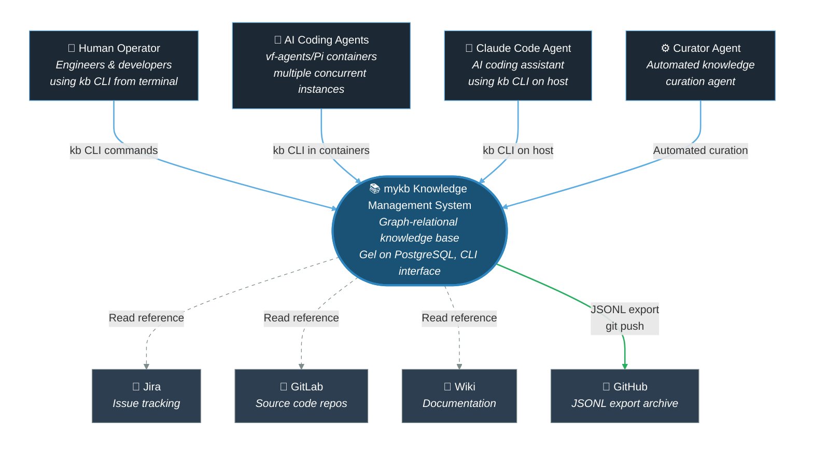
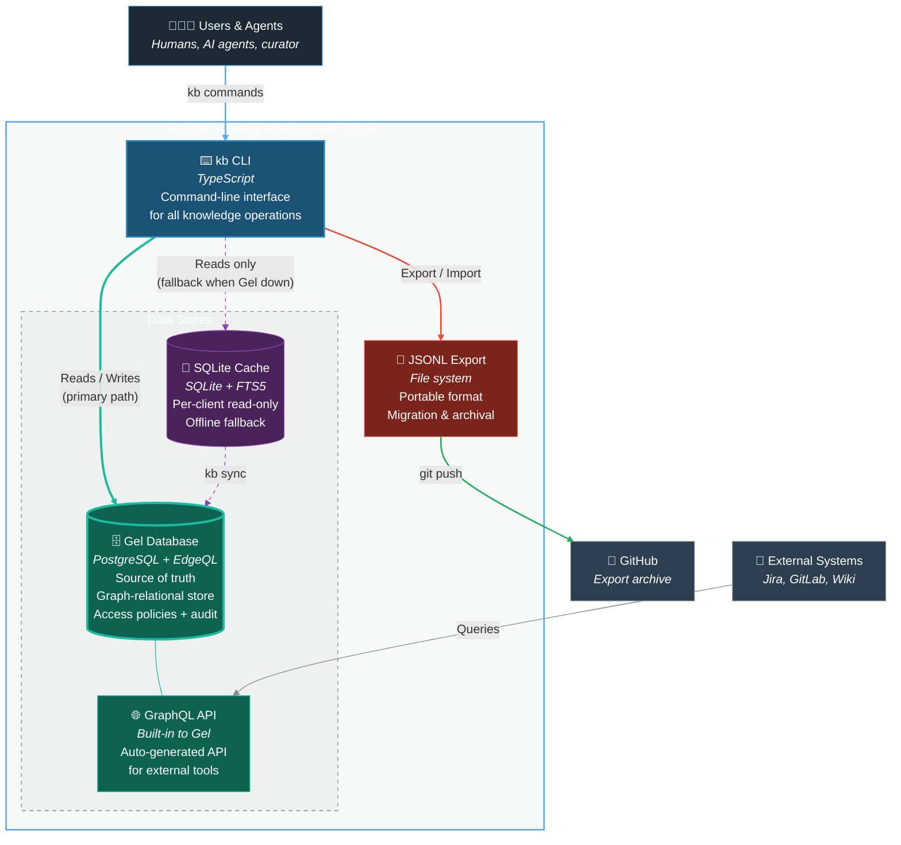
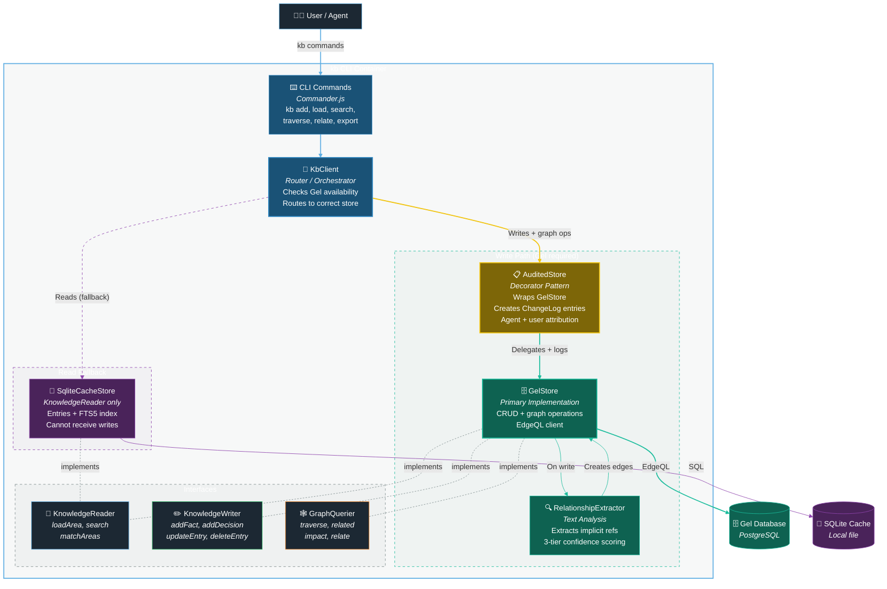

# mykb v2 Graph Backend - C4 Architecture Diagrams

This document contains the C4 architecture for the mykb v2 knowledge management system.

## C1 - System Context Diagram

Shows how mykb fits into the broader ecosystem — users, agents, and external systems.

## C2 - Container Diagram

The major containers within mykb and how they interact. Gel (PostgreSQL) is the source of truth. SQLite provides offline read fallback.

## C3 - Component Diagram (kb CLI)

Internal structure of the kb CLI. Shows the store abstractions, interface boundaries, audit logging, and relationship extraction.

## Architecture Notes

### Data Flow Examples

**Write (kb add fact):**
CLI Command → KbClient.write() → AuditedStore.addFact() → GelStore.addFact() + ChangeLog → RelationshipExtractor → graph edges

**Read (Gel available):**
CLI Command → KbClient.read() → GelStore.loadArea() → Gel Database

**Read (Gel down):**
CLI Command → KbClient.read() → Gel unavailable → SqliteCacheStore.loadArea() → SQLite Cache (staleness warning)

### Key Design Decisions

| Decision | Choice | Rationale |
|----------|--------|-----------|
| Source of truth | Gel (PostgreSQL) | Corporate KB needs ACID, concurrency, access control |
| Offline reads | SQLite cache | Degraded mode with staleness warning |
| Offline writes | Fail with error | No WAL — edge case doesn't justify distributed systems complexity |
| Audit trail | Decorator pattern | AuditedStore wraps GelStore, cannot be bypassed |
| Entry types | Polymorphic | Fact, Decision, Gotcha, Pattern, Link as separate Gel types |
| Interface split | Reader / Writer / GraphQuerier | Type system prevents accidental writes to cache |
