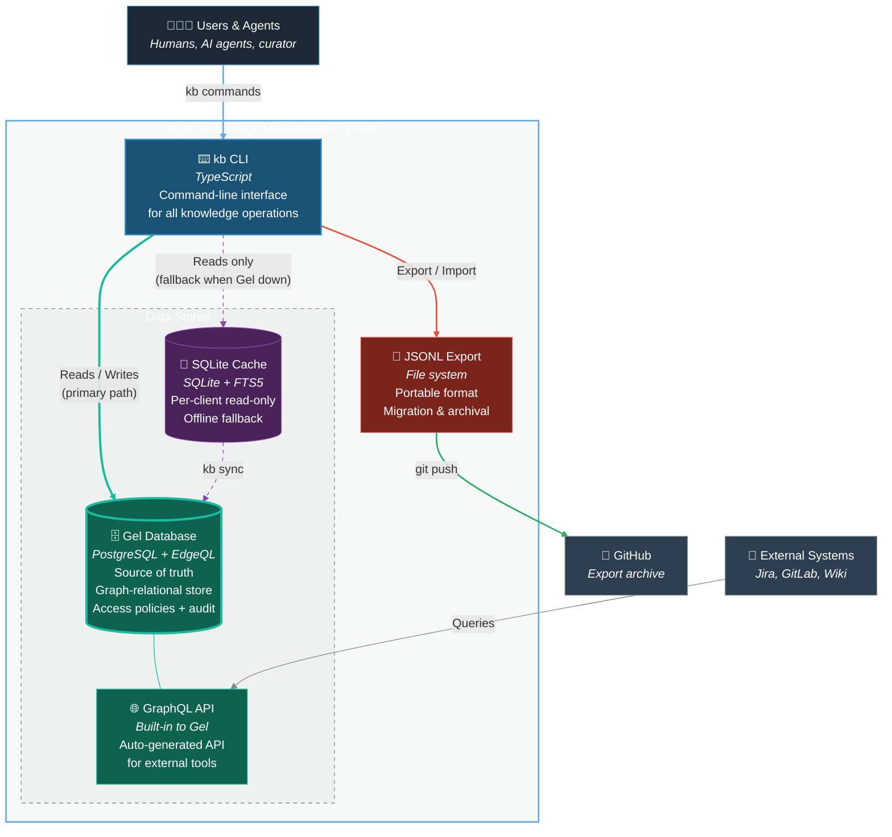
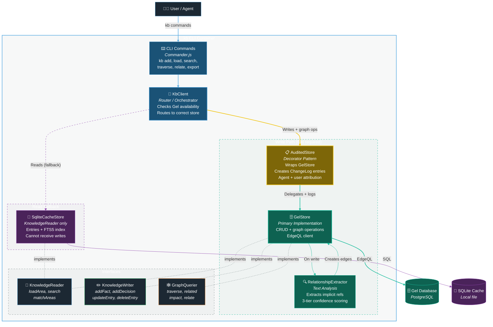
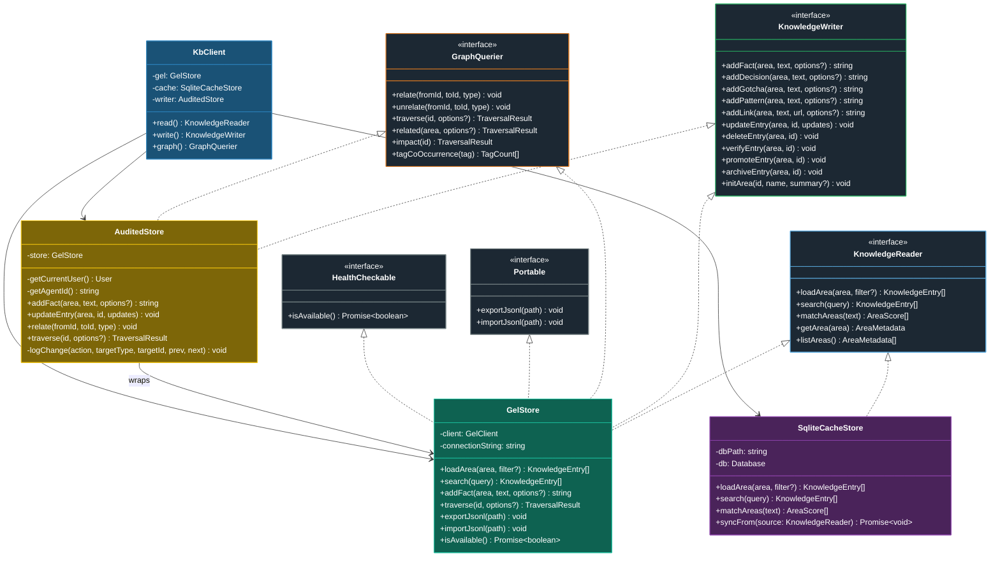
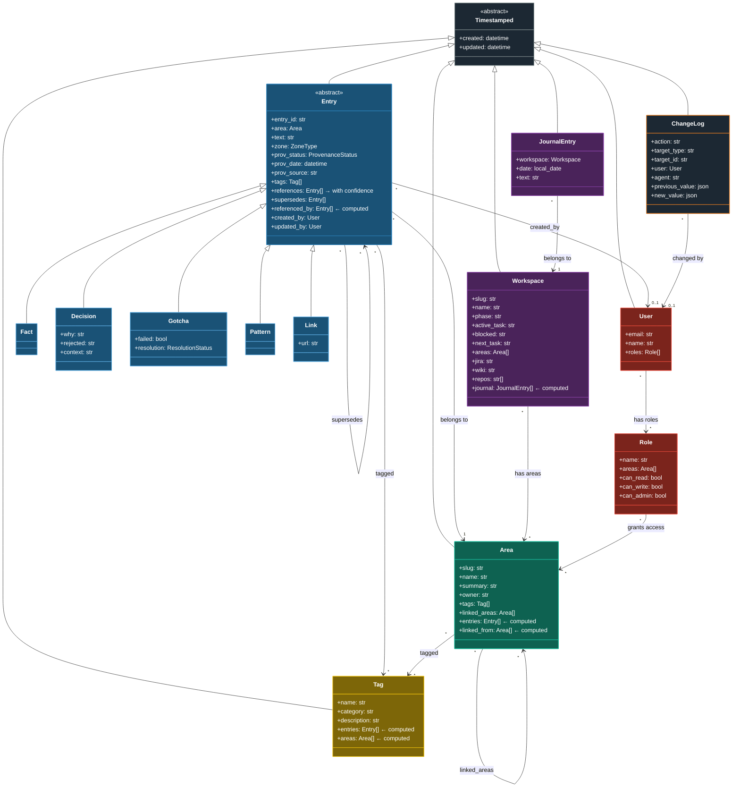
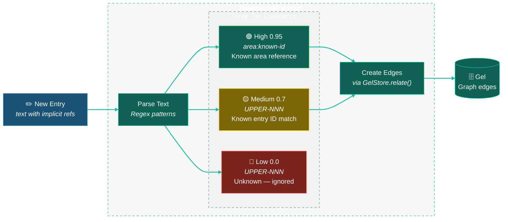

# mykb v2 Graph Backend - C4 Architecture Diagrams

This document contains the C4 architecture for the mykb v2 knowledge management system.

## C1 - System Context Diagram

Shows how mykb fits into the broader ecosystem — users, agents, and external systems.


## C2 - Container Diagram

The major containers within mykb and how they interact. Gel (PostgreSQL) is the source of truth. SQLite provides offline read fallback.



## C3 - Component Diagram (kb CLI)

Internal structure of the kb CLI. Shows the store abstractions, interface boundaries, audit logging, and relationship extraction.



## C4 - Code Level Diagrams

### C4.1 - Interfaces and Implementations

The type system enforces which stores can do what. GelStore implements all three interfaces. SqliteCacheStore implements only KnowledgeReader. AuditedStore wraps GelStore for write and graph operations.



### C4.2 - Gel Schema (Entity Relationships)

The Gel type hierarchy with polymorphic entries, graph relationships, and access control.



### C4.3 - RelationshipExtractor

The three-tier extraction pipeline that analyzes entry text and creates graph edges with confidence scores.



### C4.4 - KbClient Routing Logic

How KbClient decides where to route read and write operations based on Gel availability.

```mermaid
graph TD
    cmd["⌨️ CLI Command"]

    cmd --> is_write{{"Write or<br/>graph mutation?"}}

    is_write -->|Yes| gel_up_w{{"Gel available?"}}
    gel_up_w -->|Yes| audited["📋 AuditedStore<br/>→ GelStore + ChangeLog"]
    gel_up_w -->|No| fail["❌ Error<br/><i>Writes require Gel</i>"]

    is_write -->|No| is_graph{{"Graph query?<br/><i>traverse, related,<br/>impact</i>"}}

    is_graph -->|Yes| gel_up_g{{"Gel available?"}}
    gel_up_g -->|Yes| gel_graph["🕸️ GelStore<br/>Graph query"]
    gel_up_g -->|No| fail_g["❌ Error<br/><i>Graph queries require Gel</i>"]

    is_graph -->|No| gel_up_r{{"Gel available?"}}
    gel_up_r -->|Yes| gel_read["🗄️ GelStore<br/>Read from Gel"]
    gel_up_r -->|No| cache["💾 SqliteCacheStore<br/><i>⚠️ May be stale</i>"]

    style cmd fill:#1a5276,stroke:#2e86c1,color:#fff
    style is_write fill:#1c2833,stroke:#5dade2,color:#fff
    style is_graph fill:#1c2833,stroke:#5dade2,color:#fff
    style gel_up_w fill:#1c2833,stroke:#1abc9c,color:#fff
    style gel_up_g fill:#1c2833,stroke:#1abc9c,color:#fff
    style gel_up_r fill:#1c2833,stroke:#1abc9c,color:#fff
    style audited fill:#7d6608,stroke:#f1c40f,color:#fff
    style gel_graph fill:#0e6251,stroke:#1abc9c,color:#fff
    style gel_read fill:#0e6251,stroke:#1abc9c,color:#fff
    style cache fill:#4a235a,stroke:#8e44ad,color:#fff
    style fail fill:#7b241c,stroke:#e74c3c,color:#fff
    style fail_g fill:#7b241c,stroke:#e74c3c,color:#fff

    linkStyle 0,3,6 stroke:#5dade2,stroke-width:2px
    linkStyle 1,4,7 stroke:#1abc9c,stroke-width:2px
    linkStyle 2 stroke:#f1c40f,stroke-width:2px
    linkStyle 5 stroke:#1abc9c,stroke-width:2px
    linkStyle 8 stroke:#1abc9c,stroke-width:2px
    linkStyle 9 stroke:#8e44ad,stroke-width:2px,stroke-dasharray:5
    linkStyle 10,11 stroke:#e74c3c,stroke-width:2px
```

---

## Architecture Notes

### Data Flow Examples

**Write (kb add fact):**
CLI Command → KbClient.write() → AuditedStore.addFact() → GelStore.addFact() + ChangeLog → RelationshipExtractor → graph edges

**Read (Gel available):**
CLI Command → KbClient.read() → GelStore.loadArea() → Gel Database

**Read (Gel down):**
CLI Command → KbClient.read() → Gel unavailable → SqliteCacheStore.loadArea() → SQLite Cache (staleness warning)

### Key Design Decisions

| Decision | Choice | Rationale |
|----------|--------|-----------|
| Source of truth | Gel (PostgreSQL) | Corporate KB needs ACID, concurrency, access control |
| Offline reads | SQLite cache | Degraded mode with staleness warning |
| Offline writes | Fail with error | No WAL — edge case doesn't justify distributed systems complexity |
| Audit trail | Decorator pattern | AuditedStore wraps GelStore, cannot be bypassed |
| Entry types | Polymorphic | Fact, Decision, Gotcha, Pattern, Link as separate Gel types |
| Interface split | Reader / Writer / GraphQuerier | Type system prevents accidental writes to cache |
